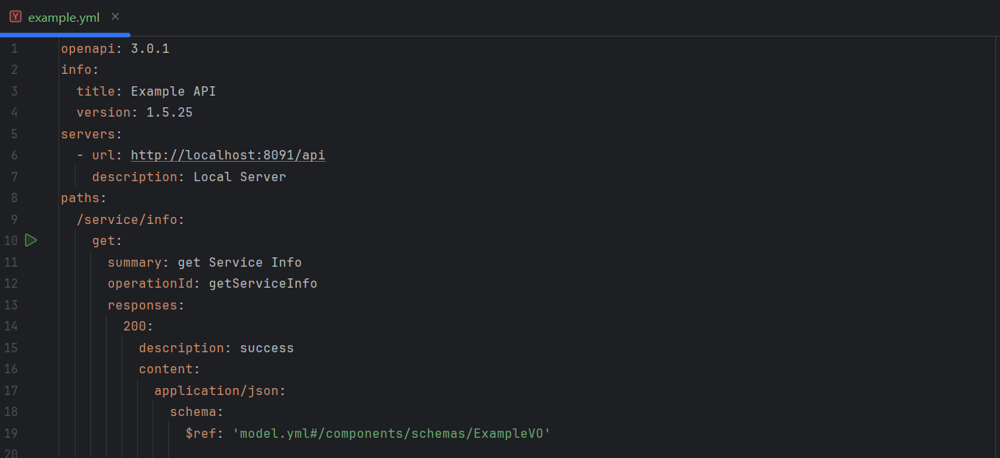
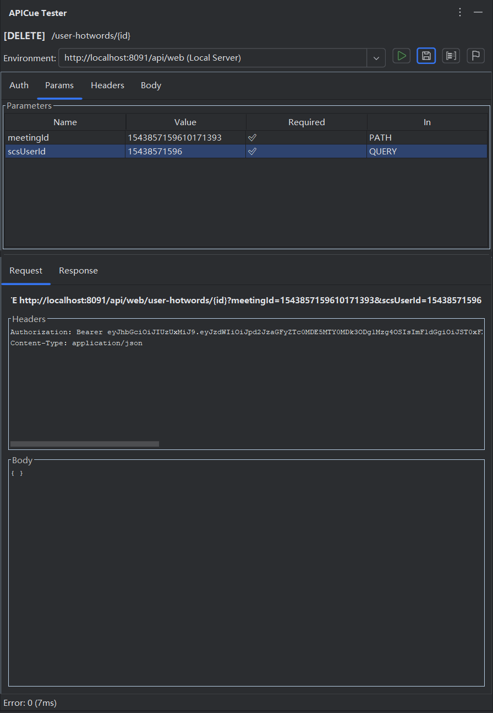

# APICue — API Testing from OpenAPI YAML Files

**Test your REST APIs directly from OpenAPI 3.0 YAML definitions — without leaving your IDE.**

APICue is an IntelliJ IDEA plugin that bridges the gap between API specification and API testing. Instead of maintaining separate `.http` files or switching to external tools like Postman, you can send requests, inspect responses, and iterate on your API design right from the YAML editor.

> ⚠️ **APICue is a commercial plugin** available on JetBrains Marketplace. This repository contains documentation, usage guides, and public materials.

---

## ✨ Features

### ▶ One-Click Testing from Gutter Icons
Green run buttons appear next to every `get:`, `post:`, `put:`, `delete:`, and `patch:` operation in your OpenAPI YAML files. Click to open the test panel instantly.

### 🖥 Dedicated ToolWindow Panel
Right-side tool window shows the full testing interface: environment selector, auth config, request editor (Params / Headers / Body tabs), and a split-pane response viewer. Stay in context — no popups or dialogs.

### 🔐 Security Scheme Auto-Discovery
Reads `components.securitySchemes` and `security` requirements from your OpenAPI spec, automatically generates the correct authentication headers (Bearer JWT, Basic Auth, API Key in header/query/cookie), and pre-fills them.

### 🌍 Multi-Environment Server Selection
Supports multiple `servers` per YAML file. The last selected URL is remembered per-file, so switching between YAML documents restores your previous choice automatically.

### 📋 Smart Parameter Pre-Fill
Query parameters, headers, and request body are pre-filled from `example`, `default`, and schema property values — following a well-defined priority hierarchy.

### 📝 Save & Load Request/Response Examples
Save working request parameters and response payloads back to the YAML file as OpenAPI examples. Load them back later for reproducible testing.

### 🔑 Token Management
Manage tokens (JWT, API keys, etc.) per environment with a built-in Token Manager. Tokens are stored securely using your IDE's password-safe mechanism.

### 🔗 $Ref Cross-File Resolution
Fully resolves `$ref` references across YAML files (e.g., `$ref: 'model.yml#/components/schemas/User'`) with caching and circular-reference detection.

### 📄 Export Test Report
Export saved examples as structured HTML or Markdown reports with custom templates, suitable for sharing, documentation, or review.

### 🌐 Internationalization (i18n)
Supports both English and Chinese UI. Automatically matches your IDE's language setting.

---

## 📸 Screenshots

| Main Tester Panel | Response Viewer |
|---|---|
|  |  |

---

## 🚀 Quick Start

1. **Install** the plugin from JetBrains Marketplace (Settings → Plugins → Marketplace → search "APICue")
2. **Open** any OpenAPI 3.0 YAML file in IntelliJ IDEA
3. **Click** the ▶ icon next to any path operation
4. **Select** your target server environment, review/edit parameters, configure auth
5. **Click** "Send Request" and inspect the response in real-time

---

## 📦 Requirements

- **IntelliJ IDEA** 2024.1+ (Ultimate or Community)
- **OpenAPI** 3.0 YAML files

### Built-in Dependencies
| Library | Version | Purpose |
|---------|---------|---------|
| OkHttp | 4.12 | HTTP client |
| SnakeYAML | 2.2 | YAML parsing |
| Kotlinx Coroutines | — | Async request handling |

---

## 📚 Documentation

- [Quick Start Guide](docs/quickstart.md)
- [Feature Details](docs/features.md)
- [FAQ](docs/faq.md)
- [Changelog](CHANGELOG.md)

---

## 🏷 IDE Marketplace Info

- **Category**: Web Services / REST · Tools / Integration
- **Tags**: `OpenAPI` · `REST API` · `YAML` · `API Testing` · `Swagger`
- **Compatibility**: IntelliJ IDEA 2024.1+

---

## 📄 License

The documentation in this repository is licensed under the MIT License. The APICue plugin itself is a commercial product distributed via JetBrains Marketplace under a separate license agreement.

---

## 📬 Contact

- **Website**: [https://www.apicue.com](https://www.apicue.com)
- **Email**: [api-cue@gmail.com](mailto:api-cue@gmail.com)
